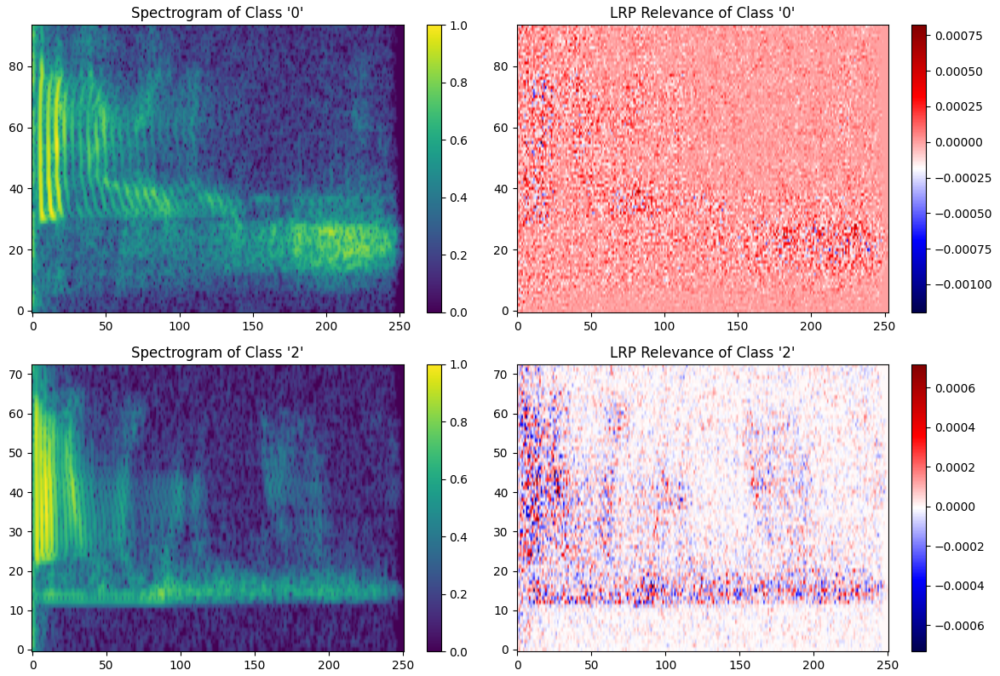
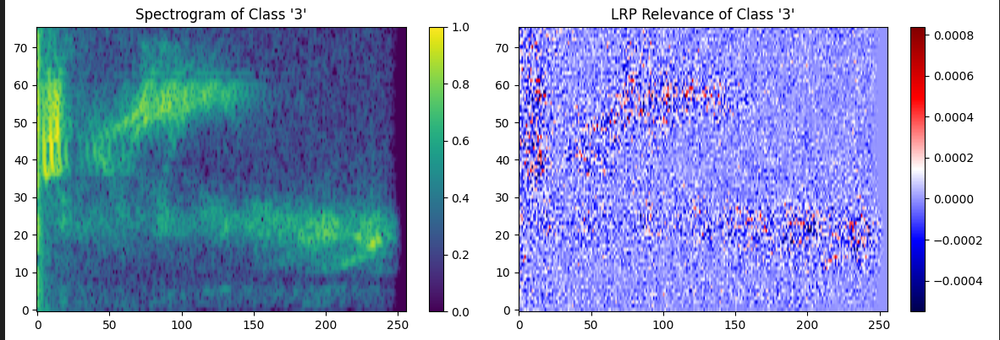
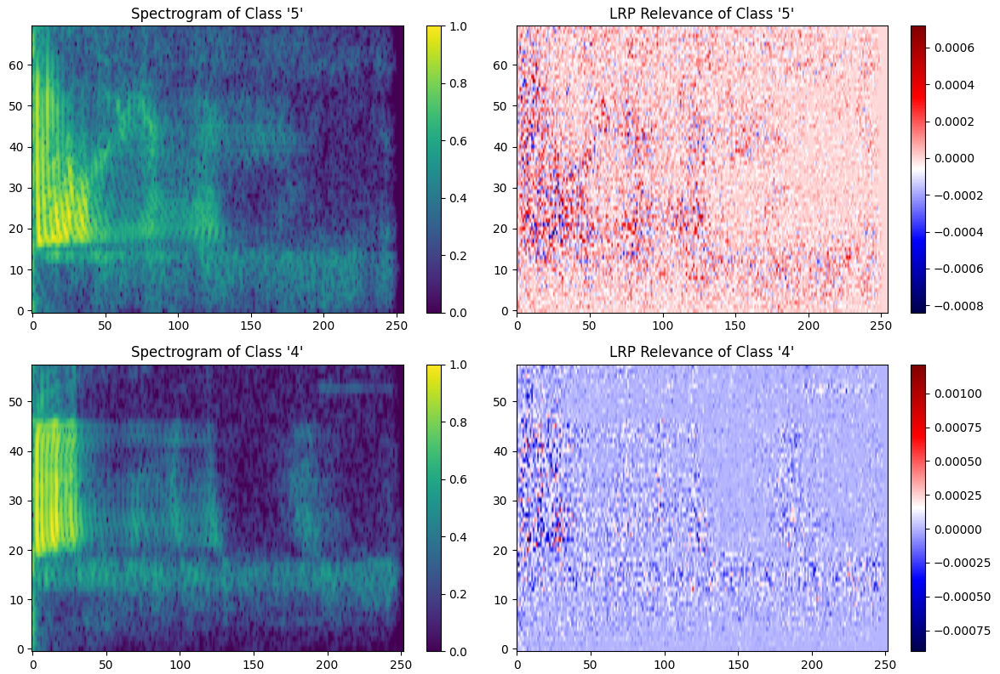
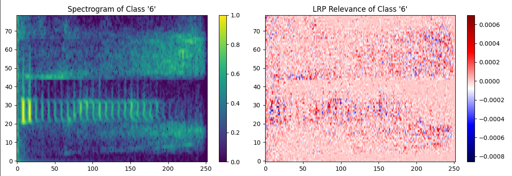
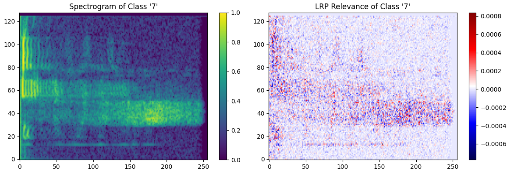
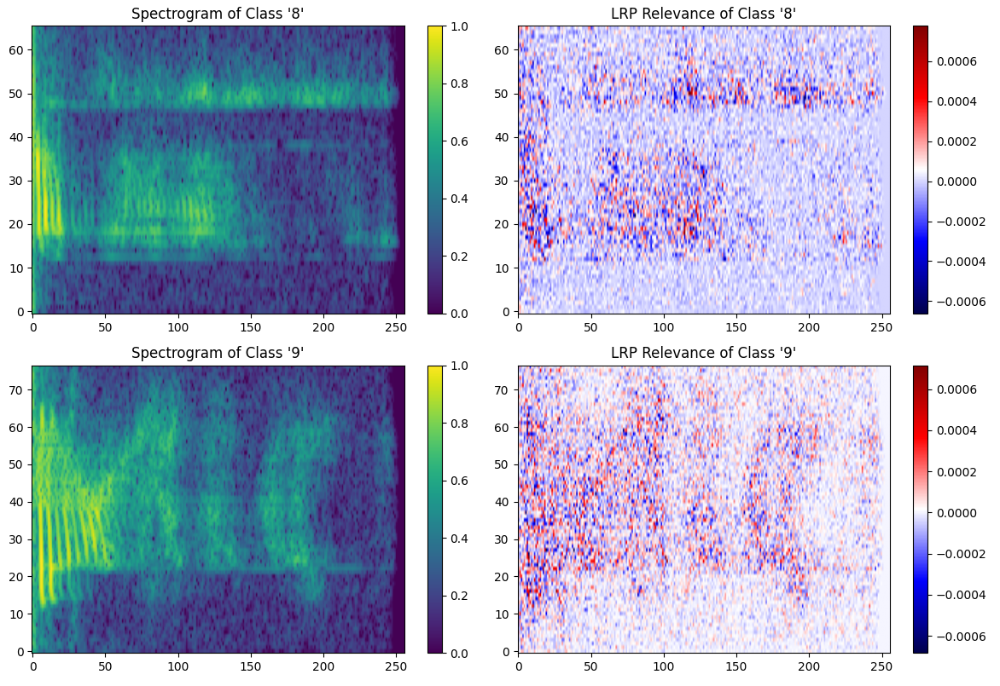

<h1 align="center">🎧 Layer-Wise Relevance Propagation (LRP) for Explainable Audio Classification using AudioMNIST</h1>

<p align="center">
  
  
  
  
</p>

---

## 📘 Overview
This project demonstrates the application of **Layer-Wise Relevance Propagation (LRP)** - an **Explainable AI (XAI)** technique - on a **Convolutional Neural Network (CNN)** trained over the **AudioMNIST dataset**.  
The main goal is to visualize **how and why** the model makes specific predictions for spoken digits by mapping **feature relevance** back to the input mfcc and spectrograms.

By interpreting neural network decisions at the feature level, LRP enhances model transparency, helping researchers and developers build more **trustworthy** and **interpretable** AI systems in audio classification.

---

## 🎯 Objectives
- Apply **Layer-Wise Relevance Propagation (LRP)** on a CNN trained for digit recognition.  
- Visualize **relevance heatmaps** on **AudioMNIST** spectrograms to interpret CNN focus regions.  
- Analyze **feature importance** across layers for explainability.  
- Showcase the **Explainable AI** perspective in audio deep learning models.

---

## 🧠 What is Layer-Wise Relevance Propagation (LRP)?
**Layer-Wise Relevance Propagation (LRP)** is a popular **post-hoc explainability** technique that explains the output of deep neural networks by redistributing the final prediction score backward through the network layers.

It assigns a **relevance score (R)** to each neuron, indicating its contribution to the final decision.  
This helps identify **which frequency bands or time regions** in an audio spectrogram most strongly influenced the classification.

Mathematically, LRP ensures:  
$$\sum_i R_i^{(l)} = \sum_j R_j^{(l+1)} = f(x)$$

---

## 🧩 Methodology

1. **Dataset - AudioMNIST**
   - A collection of spoken digits (0–9) from multiple speakers.
   - Converted to **Mel-spectrograms** for model input.

2. **Model Training**
   - A **Convolutional Neural Network (CNN)** is trained to classify digits based on spectrogram patterns.
   - Model trained using **cross-entropy loss** and **Adam optimizer**.

3. **LRP Execution**
   - Post-training, the CNN is analyzed using **Layer-Wise Relevance Propagation (LRP)**.
   - Relevance scores are computed layer by layer.
   - The resulting heatmaps are overlaid on spectrograms to visualize the model’s attention.

4. **Analysis**
   - Identify dominant frequency regions used by the model for classification.
   - Compare correct vs. misclassified samples for model trust assessment.

---

## 🖼️ Visualization Results

### Sample Spectrograms and LRP Heatmaps

| Description | Visualization |
|--------------|----------------|
| **LRP Heatmap for Digit (“0” and “2”) Prediction** |  |
| **LRP Heatmap for Digit “3” Prediction** |  |
| **LRP Heatmap for Digit (“4” and “5”) Prediction** |  |
| **LRP Heatmap for Digit (“6”) Prediction** |  |
| **LRP Heatmap for Digit (“7”) Prediction** |  |
| **LRP Heatmap for Digit (“8” and “9”) Prediction** |  |

> 🧩 *All visualizations generated from CNN activations using custom LRP implementation.*

---

## ⚙️ How to Run

1. **Clone the Repository**
   ```bash
   git clone https://github.com/Sudip-329/Layer-Wise_Relavance_Propagation_LRP_XAI_Audio-MNIST.git
   cd Layer-Wise_Relevance_Propagation_LRP_XAI_Audio-MNIST
